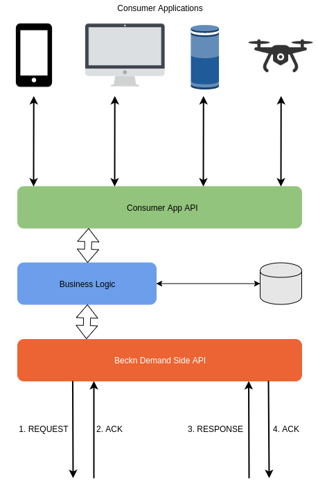
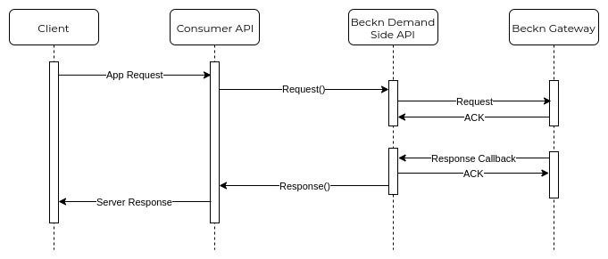

# Context

Let's imagine that you're developing a brand new Mobility as a Service (MaaS) application. It has a client side mobile app which provides end-to-end mobility services to the user. The Beckn App Interface will support the following transactions -

* The user can Search for avaiilable mobility services around him/her
* The user can Search for a multi-modal journey between an Origin and a Destination at a particular Time
* The user can provide the Intent of the journey while searching
* The user can Select a Journey from one of the available search results
* The user can view the Schedules/Timetables of various mass transit services in the Journey
* The user can provide his Credentials (if needed) to any particular Mobility Service requesting it
* The user can add Fare Products (promo codes, discount coupons, daily/monthly passes) to relevant Trips of the Journey
* The user can receive messages about Trip state changes
* The user can Add a Trip to an ongoing Journey
* The user can Add a Stop to a Trip
* The user can Add a Passenger to a Trip
* The user can Remove a Trip from an ongoing Journey if the Trip's Service has not been availed yet
* The user can Cancel an entire Journey before starting it
* The user can request Refund for an incorrectly charged Trip
* The user can Start, Pause or Stop a Trip if the availed Mobility Service allows it. For example : Vehicle Rentals
* The user can Stop an ongoing Trip. For example : During Emergency Situations
* The user can Pay for a Journey before, during or after the Journey depending on the availed Service
* The user can submit Feedback and Rating for Trip
* The user can submit Feedback and Rating for the Overall Journey

# Problem
What software does your Consumer Application need to implement in order to provide the above functionalities ?

# Solution

To implement the functionalities listed above, the consumer app provider will develop a server-side application which exposes a REST API to the Mobile App. Secondly, the Server  will implement the Beckn App API which will communicate with a Beckn Gateway App Side API.

All communication between the Beckn App Interface and the Beckn Gateway will be Asynchronous. This means that all messages sent to the Beckn Gateway will be immediately followed by an ACK or NACK message. Any and all validation errors will be handled and sent back in a synchronous manner.

The actual response will be returned using a Callback message from the Beckn Gateway App Side Interface. This means that the Beckn App Interface will have to implement callback methods to handle the response from the Beckn Gateway. All Request and Response payload format will be in JSON (RFC 8259).

## Architecture

The Architecture of the Beckn App Interface is shown in the image below.

The Consumer App Server will implement Beckn App API (as shown above) to communicate with the Beckn Ecosystem. Please note that the Beckn App API layer does not depend upon the consumer facing architecture. The business logic module in the above diagram could vary depending upon scope and scale of the application.

## Flow of Data

The following sequence diagram illustrates the flow of data between the Consumer Application and the Beckn Gateway.

## API Specifications

To implement the Beckn App API, the Consumer Application must implement the methods as per the specifications found [**here**](/APIReference/BecknAppAPI)
