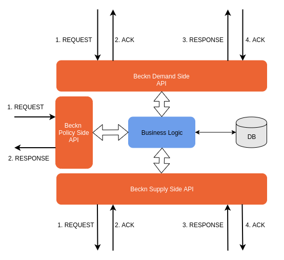
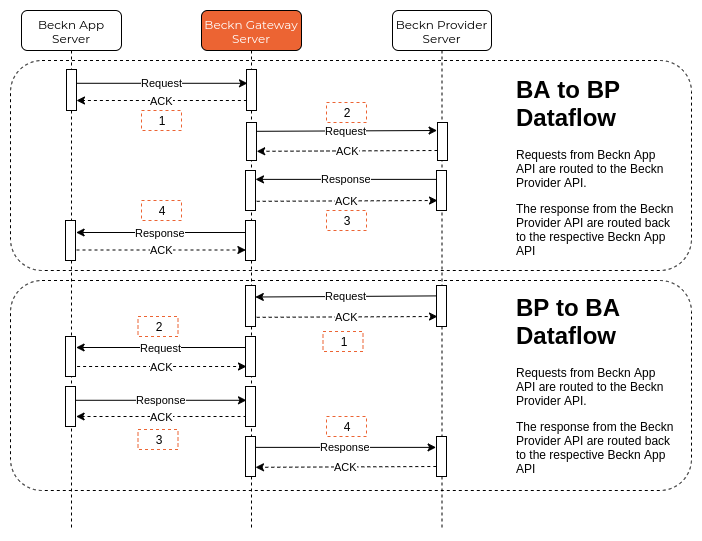

# Context

Let's imagine that you are a developer creating a Mobility Gateway. It is a regulated entity registered with the city transport authorities. It can be implemented by anyone with the resources and compute power to provide the functionalities listed below -

* It should route requests from Beckn Apps to Beckn Providers and responses from Beckn Providers to Beckn Apps.
* It should route requests from Beckn Providers to Beckn Apps and responses from Beckn Apps to Beckn Providers.
* It should collect payments from customers and settle the payment to the respective Beckn Providers.
* It should implement a Trip Stitching algorithm as part of its Search microservice.
* It should check for policy compliance for each service availed or rendered
* It should have enough spatial context to insert short transfers in between Stops. (More about this in the Trip Stitching algorithm section)
* It should provide data points to enable efficient mobility analytics without violating user privacy.
* It should refresh policy peiodically
* It should be able to electronically onboard Mobility Service Providers by validating the necessary documentation according to the city/state laws
* As an optional feature, the Gateway should be able to electronically verify the documentation provided by the Beckn Providers
* It should electronically validate the authenticity of the Beckn App and Beckn Provider for all transactions
* It should be able to digitally sign messages coming from Beckn Apps and Beckn Providers

# Problem
What software does the Beckn Gateway need to implement in order to provide the above functionalities ?

# Solution

To implement the functionalities listed above, the Gateway Developer will develop a server-side application which exposes an API which will communicate with the Beckn App API. Secondly, The Gateway will implement a Supply Side API which will communicate with the Beckn Provider API.

Thirdly, the Beckn Gateway will also implement the Beckn Policy API. This API will allow policy creation, updation and implementation by the city transport authoritiy.

All communication between the Beckn App Interface and the Beckn Gateway will be Asynchronous. This means that all messages sent to the Beckn Gateway will be immediately followed by an ACK or NACK message. Any and all validation errors will be handled and sent back in a synchronous manner with a NACK response.

All communication between the Beckn Provider Interface and the Beckn Gateway will be Asynchronous. This means that all messages sent to the Beckn Gateway will be immediately followed by an ACK or NACK message. Any and all validation errors will be handled and sent back in a synchronous manner with a NACK response.

The actual response will be returned using a Callback message. This means that the Beckn Gateway will have to implement callback methods to handle the response from the Beckn Apps and Beckn Providers. All Request and Response payload format will be in JSON (RFC 8259).

## Architecture

The Architecture of the Beckn Gateway Interface is shown in the image below.

The Beckn Gateway Server will implement all the three APIs i.e Beckn App Side API, the Supply Side API and the Policy Side API to integrate with the Beckn Ecosystem. The business logic module in the above diagram could vary depending upon scope and scale of the gateway.

## Flow of Data

The following sequence diagram illustrates the flow of data through the Beckn Gateway.

## API Specifications

To implement the **Beckn Gateway App Side API**, the Beckn Gateway must implement the methods as per the specifications found [**here**](/APIReference/BecknGatewayDemandSide)

To implement the **Beckn Gateway Provider Side API**, the Beckn Gateway must implement the methods as per the specifications found [**here**](/APIReference/BecknGatewayProviderSide)
