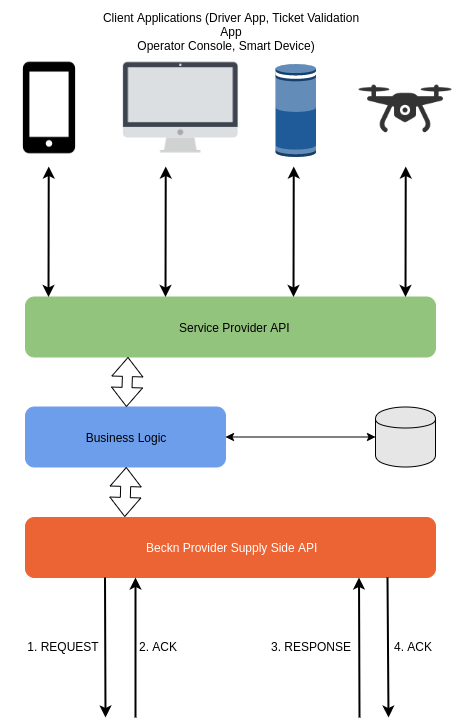
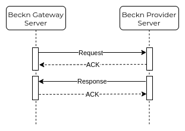

# Context

Let's imagine that you are a developer creating a Beckn Provider (BP). A BP is the API which exposes the mobility service end of the Beckn Mobility network. It is a regulated entity registered with the city transport authorities. This API allows the Beckn Provider to publish mobility inventory on the cloud. The BP may have a client side App which might be used by drivers, operators or smart devices installed in vehicles.Also, the BP doesn't necessarily need to own mobility inventory. The BP API can be implemented by any transport agency with inventory and cloud infrastructure OR by any SaaS provider working in partnership with Mobility inventory Suppliers. In either case, the Beckn Provider API implements the following functionalities -

* Search all available inventory around a location
* Search for all serviceable trips between an origin and a destination
* Search with Intent
* Request traveler details and credentials if needed
* Update travel details of a Trip
* Publish offers, promotions and information about its Services
* Identify any resource uniquely in its inventory
* Confirm a trip provided all required details of the travel are available
* Reject a trip request
* Cancel a trip
* Start, Pause and Stop a Trip (from Driver/Operator client application)
* It should be able to provide tracking endpoints to the Beckn Apps

# Problem
What software does the Beckn Provider need to implement in order to provide the above functionalities ?

# Solution

To implement the functionalities listed above, the Beckn Provider Developer will develop a server-side application which exposes a Provider Side API which will communicate with the Beckn Gateway Provider Side API.

All communication between the Beckn Provider and the Beckn Gateway will be asynchronous. This means that all messages sent to the Beckn Gateway will be immediately followed by an ACK or NACK message. Any and all validation errors will be handled and sent back in a synchronous manner with a NACK response.

The actual response will be returned using a Callback message. This means that the BP will have to implement callback methods to handle the response from the Beckn Gateways. All Request and Response payload format will be in JSON (RFC 8259).

The Architecture of the Beckn Provider Interface is shown in the image below.

### Flow of Data

The following sequence diagram illustrates the flow of data between the Beckn Provider and the Beckn Gateway.

## API Specifications

To implement the Beckn Provider API, the Mobility Service Provider server must implement the methods as per the specifications found [**here**](/APIReference/BecknProviderAPI)
